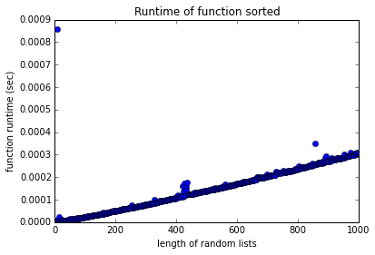

# runtime_visualizer
 

A simple library for visualizing the run-time complexity of python data structures and algorithms. 

## Introduction
`rtviz` works by mapping a function over a list of lists and plotting the runtime of each function call agains the length of the list element.

See the [extended tutorial](https://thundershiviah.github.io/runtime_visualizer/).

## Quickstart


```python
from rtviz import rtviz
%matplotlib inline
```


```python
help(rtviz)
```

    Help on function rtviz in module rtviz.main:
    
    rtviz(func, *args, max_size=1000, num_samples=500, viz=True, verbose=True)
        Takes in a function that receives an iterable as input.
        Returns a plot of the runtimes over iterables of random integers of increasing length.
        
        func: a function that acts on an iterable
    


```python
rtviz(sorted)
```

    sorted took 110.733ms.




The MIT License (MIT)

Copyright (c) 2015 Thunder Shiviah

Permission is hereby granted, free of charge, to any person obtaining a copy
of this software and associated documentation files (the "Software"), to deal
in the Software without restriction, including without limitation the rights
to use, copy, modify, merge, publish, distribute, sublicense, and/or sell
copies of the Software, and to permit persons to whom the Software is
furnished to do so, subject to the following conditions:

The above copyright notice and this permission notice shall be included in all
copies or substantial portions of the Software.

THE SOFTWARE IS PROVIDED "AS IS", WITHOUT WARRANTY OF ANY KIND, EXPRESS OR
IMPLIED, INCLUDING BUT NOT LIMITED TO THE WARRANTIES OF MERCHANTABILITY,
FITNESS FOR A PARTICULAR PURPOSE AND NONINFRINGEMENT. IN NO EVENT SHALL THE
AUTHORS OR COPYRIGHT HOLDERS BE LIABLE FOR ANY CLAIM, DAMAGES OR OTHER
LIABILITY, WHETHER IN AN ACTION OF CONTRACT, TORT OR OTHERWISE, ARISING FROM,
OUT OF OR IN CONNECTION WITH THE SOFTWARE OR THE USE OR OTHER DEALINGS IN THE
SOFTWARE.

