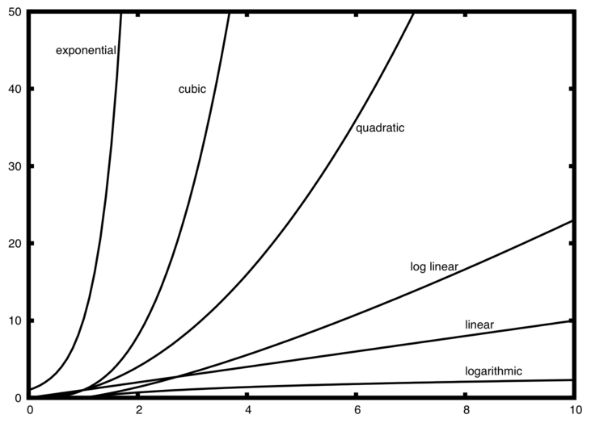

# `rtviz` Tutorial

## Introduction
`rtviz` is a small library for visualizing the runtimes of certain functions in python. 

`rtviz` works by mapping a function over a list of lists and plotting the runtime of each function call agains the length of the list element.

## Quickstart


```python
from rtviz import rtviz
%matplotlib inline
```


```python
help(rtviz)
```

    Help on function rtviz in module rtviz.main:
    
    rtviz(func, *args, max_size=1000, num_samples=500, viz=True, verbose=True)
        Takes in a function that receives an iterable as input.
        Returns a plot of the runtimes over iterables of random integers of increasing length.
        
        func: a function that acts on an iterable
    


```python
rtviz(sorted)
```

    sorted took 110.733ms.


# Extended explanation

*The below table is borrowed from the [python time complexity page](https://wiki.python.org/moin/TimeComplexity).

The [big O runtime values](https://en.wikipedia.org/wiki/Analysis_of_algorithms#Orders_of_growth) correspond to increasing the input size that we run our algorithms against. We get the average case of runtimes if we run our algorithms on randomly generated lists.


```python

```


<h1 id="list">list</h1>
<div><table style="width:"><tbody><tr>  <td><p class="line891"><strong>Operation</strong> </td>
  <td><p class="line891"><strong>Average Case</strong> </td>
  <td><p class="line891"><strong><a class="http" href="http://en.wikipedia.org/wiki/Amortized_analysis">Amortized Worst Case</a></strong> </td>
</tr>
<tr>  <td><span class="anchor" id="line-10"></span><p class="line862">Copy </td>
  <td><p class="line862">O(n) </td>
  <td><p class="line862">O(n) </td>
</tr>
<tr>  <td><span class="anchor" id="line-11"></span><p class="line862">Append[1] </td>
  <td><p class="line862">O(1) </td>
  <td><p class="line862">O(1) </td>
</tr>
<tr>  <td><span class="anchor" id="line-12"></span><p class="line862">Insert </td>
  <td><p class="line862">O(n) </td>
  <td><p class="line862">O(n) </td>
</tr>
<tr>  <td><span class="anchor" id="line-13"></span><p class="line862">Get Item </td>
  <td><p class="line862">O(1) </td>
  <td><p class="line862">O(1) </td>
</tr>
<tr>  <td><span class="anchor" id="line-14"></span><p class="line862">Set Item </td>
  <td><p class="line862">O(1) </td>
  <td><p class="line862">O(1) </td>
</tr>
<tr>  <td><span class="anchor" id="line-15"></span><p class="line862">Delete Item </td>
  <td><p class="line862">O(n) </td>
  <td><p class="line862">O(n) </td>
</tr>
<tr>  <td><span class="anchor" id="line-16"></span><p class="line862">Iteration </td>
  <td><p class="line862">O(n) </td>
  <td><p class="line862">O(n) </td>
</tr>
<tr>  <td><span class="anchor" id="line-17"></span><p class="line862">Get Slice </td>
  <td><p class="line862">O(k) </td>
  <td><p class="line862">O(k) </td>
</tr>
<tr>  <td><span class="anchor" id="line-18"></span><p class="line862">Del Slice </td>
  <td><p class="line862">O(n) </td>
  <td><p class="line862">O(n) </td>
</tr>
<tr>  <td><span class="anchor" id="line-19"></span><p class="line862">Set Slice </td>
  <td><p class="line862">O(k+n) </td>
  <td><p class="line862">O(k+n) </td>
</tr>
<tr>  <td><span class="anchor" id="line-20"></span><p class="line862">Extend[1] </td>
  <td><p class="line862">O(k) </td>
  <td><p class="line862">O(k) </td>
</tr>
<tr>  <td><span class="anchor" id="line-21"></span><p class="line891"><a class="http" href="http://svn.python.org/projects/python/trunk/Objects/listsort.txt">Sort</a> </td>
  <td><p class="line862">O(n log n) </td>
  <td><p class="line862">O(n log n) </td>
</tr>
<tr>  <td><span class="anchor" id="line-22"></span><p class="line862">Multiply </td>
  <td><p class="line862">O(nk) </td>
  <td><p class="line862">O(nk) </td>
</tr>
<tr>  <td><span class="anchor" id="line-23"></span><p class="line862">x in s </td>
  <td><p class="line862">O(n) </td>
  <td><p class="line862"> </td>
</tr>
<tr>  <td><span class="anchor" id="line-24"></span><p class="line862">min(s), max(s) </td>
  <td><p class="line862">O(n) </td>
  <td><p class="line862"> </td>
</tr>
<tr>  <td><span class="anchor" id="line-25"></span><p class="line862">Get Length </td>
  <td><p class="line862">O(1) </td>
  <td><p class="line862">O(1) </td>
</tr>
</tbody></table></div><span class="anchor" id="line-26"></span><span class="anchor" id="line-27"></span><span class="anchor" id="line-28"></span><span class="anchor" id="line-29"></span><span class="anchor" id="line-30"></span><p class="line867">


The big O runtime values can be visualized as the runtime of an algorithm vs. the size of a data structure (in our case a list) the algorithm runs on.  



We can check that the big O runtime values are true by explicitly plotting the runtime of an algorithm against the length of randomly generated lists.

For instance, from the above table we see calling the `max` function on a list runs on the order of the length of the list ($O(n)$), while calling the `len` function (which returns the length of a list) should be constant time ($O(1)$) no matter what size list we call it on. 

Let's see if this is true:

We first call `rtviz` with the function `max`.


```python
rtviz(max) # Linear 
```

    max took 30.693ms.


Sure enough, we see a linear relationship between runtime of the `max` function and list length.

Next we call `len`, which we would expect to be constant time ($O(1)$).


```python
rtviz(len)
```

    len took 30.307ms.


We see that the runtimes of the `len` method are indeed flat, therefore the runtime is constant. 

There is however something a bit unexpected about our graph of the `len` function: we see multiple lines!

If we instead try calling `__len__` which returns the length of an object, we still get the same behavior.


```python
def length(lst):
    return lst.__len__()

assert length([1,2,3]) == 3
```


```python
rtviz(length)
```

    length took 17.286ms.


Use of rtviz often reveals interesting insights into python's actual implementation. In this case, by visualizing the `len` method, we are actually seeing the lookup time of a hash table implemented in C. Although the average runtime is constant (as evidenced by the flat lines), depending on how good the hash of our `__len__` attribute is we get faster or slower performance (as evidenced by the multiple stacked lines). See [this blog post](http://www.laurentluce.com/posts/python-list-implementation/) and the original [python object implementation in c](http://www.laurentluce.com/posts/python-list-implementation/) for more details. 


```python

```
